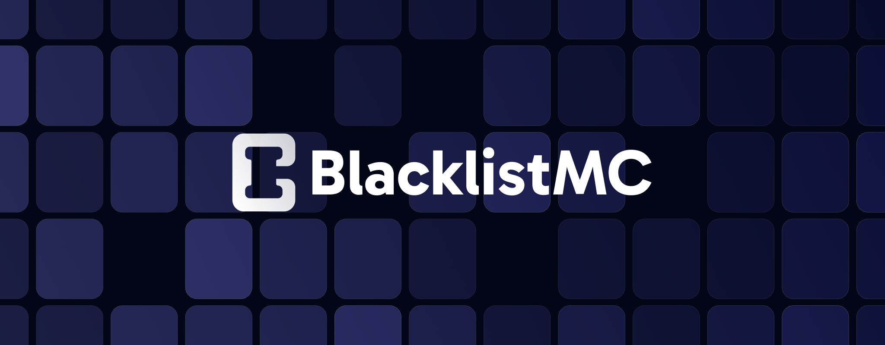

# [BlacklistMC](https://blacklistmc.fr)

BlacklistMC centralise les blacklists Minecraft pour une gestion simplifiée des bannissements. Des modérateurs expérimentés garantissent des sanctions justes et efficaces.

## Pourquoi utiliser notre site?

- Vérifiez la crédibilité de certains prestataires.
- Centralise les blacklists Minecraft pour une gestion simplifiée des bannissements.
- Des modérateurs expérimentés garantissent des sanctions justes et efficaces.

## Objectifs à court terme

- [ ] Sécuriser l'ensemble de l'API
- [ ] Permettre la gestion des différentes preuves
- [ ] Permettre à l'aide du dashboard de gérer les différents users
- [ ] Permettre à l'aide du dashboard de gérer les différents blacklists
- [ ] Ajouter la vue pour récupérer les informations sur un blacklist
- [ ] et plus encore...

Vous pouvez contribuer au projet en signalant des problèmes, suggérant de nouvelles fonctionnalités ou en soumettant des pull requests sur GitHub.

